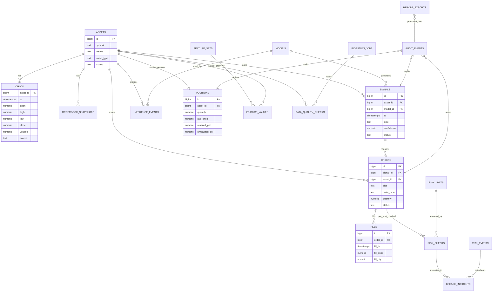

# Complete Stack Enhancement Suggestions for Neural Network Trading System

## Part 1: Frontend Enhancements (1-110)

---

## Professional Color Scheme Recommendations

### Primary Color Palette (Dark Theme - Recommended for Trading)
- **Background Primary**: `#0d1117` (Deep navy black)
- **Background Secondary**: `#161b22` (Dark charcoal)
- **Background Tertiary**: `#21262d` (Elevated surface)
- **Border Color**: `#30363d` (Subtle borders)
- **Text Primary**: `#f0f6fc` (Bright white)
- **Text Secondary**: `#8b949e` (Muted gray)
- **Text Tertiary**: `#6e7681` (Dimmed text)
- **Accent Primary**: `#58a6ff` (Electric blue)
- **Accent Secondary**: `#1f6feb` (Deep blue)
- **Success/Profit**: `#3fb950` (Vibrant green)
- **Danger/Loss**: `#f85149` (Vivid red)
- **Warning**: `#d29922` (Amber gold)
- **Info**: `#a371f7` (Soft purple)

### Light Theme Alternative
- **Background Primary**: `#ffffff`
- **Background Secondary**: `#f6f8fa`
- **Background Tertiary**: `#eaeef2`
- **Border Color**: `#d0d7de`
- **Text Primary**: `#1f2328`
- **Text Secondary**: `#656d76`
- **Accent Primary**: `#0969da`

---

### 1. Layout & Structural Enhancements [1-10]
1. Implement a responsive grid layout using CSS Grid with 12-column system
2. Add a collapsible sidebar navigation with smooth transitions
3. Create a sticky header with breadcrumb navigation and global search
4. Implement a footer with system status, version info, and quick links
5. Add a dashboard layout with draggable/resizable widget panels
6. Use CSS container queries for component-level responsiveness
7. Implement a split-pane view for detailed data inspection
8. Add a tabbed interface for organizing different dashboard sections
9. Create a modal system for detailed views and forms
10. Implement a toast notification system in the corner

### 2. Visual Design & Color Enhancements [11-20]
11. Apply the professional dark color scheme consistently across all components
12. Add subtle box shadows with color tinting (`box-shadow: 0 4px 12px rgba(88, 166, 255, 0.1)`)
13. Implement glassmorphism effects for overlay panels (`backdrop-filter: blur(10px)`)
14. Add gradient backgrounds to section headers
15. Use color coding consistently: green for profit/positive, red for loss/negative
16. Implement smooth color transitions on hover states
17. Add subtle border glow effects on focus (`box-shadow: 0 0 0 3px rgba(88, 166, 255, 0.3)`)
18. Use micro-animations for value changes (counting up/down effects)
19. Implement skeleton loading screens with shimmer effects
20. Add subtle noise texture to backgrounds for depth

### 3. Typography Enhancements [21-30]
21. Use a modern font stack: `'Inter', 'SF Pro Display', -apple-system, sans-serif`
22. Implement proper font sizing scale (4px base: 12, 14, 16, 20, 24, 32, 48)
23. Add font-weight variations: 400 (regular), 500 (medium), 600 (semibold), 700 (bold)
24. Implement proper line-height ratios (1.5 for body, 1.2 for headings)
25. Add letter-spacing adjustments for headings (`letter-spacing: -0.02em`)
26. Use tabular-nums font feature for numerical data alignment
27. Add text truncation with ellipsis for overflow content
28. Implement proper text hierarchy with visual distinction
29. Add proper paragraph spacing (16px minimum between blocks)
30. Use monospace font for numerical values and code displays

### 4. Data Visualization & Charts [31-45]
31. Integrate Chart.js or D3.js for interactive price charts
32. Add candlestick charts for price history visualization
33. Implement line charts with gradient fills for trend analysis
34. Add volume bar charts below price charts
35. Create pie/donut charts for portfolio allocation
36. Implement heatmaps for correlation matrices
37. Add sparkline mini-charts in metric cards
38. Create interactive tooltips with crosshair on charts
39. Implement zoom and pan functionality for time series
40. Add chart annotations for significant events
41. Create comparison overlays for multiple assets
42. Implement real-time chart updates with WebSocket
43. Add technical indicator overlays (SMA, EMA, Bollinger Bands)
44. Create custom chart timeframes (1H, 4H, 1D, 1W, 1M)
45. Implement chart export functionality (PNG, SVG, CSV)

### 5. Metric Cards & KPI Display [46-55]
46. Redesign metric cards with consistent padding (16px-24px)
47. Add trend indicators (arrows showing up/down/neutral)
48. Implement percentage change badges with color coding
49. Add mini sparklines showing recent trend
50. Create comparison metrics (vs. yesterday, vs. last week)
51. Add tooltips explaining each metric definition
52. Implement click-to-drill-down functionality
53. Create grouped metric sections with headers
54. Add timestamp showing data freshness
55. Implement metric value animations on update

### 6. Interactivity & User Experience [56-65]
56. Implement keyboard shortcuts for common actions
57. Add context menus for right-click actions
58. Create keyboard-navigable dropdown menus
59. Implement proper focus management for modals
60. Add skip links for accessibility
61. Implement touch-friendly tap targets (minimum 44px)
62. Add pull-to-refresh on mobile devices
63. Implement infinite scroll for data tables
64. Create keyboard shortcuts overlay (press ? to view)
65. Add gesture support for chart interactions

### 7. Table & Data Grid Enhancements [66-75]
66. Implement sortable columns with visual indicators
67. Add column resizing with drag handles
68. Create sticky header rows on scroll
69. Add row selection with checkboxes
70. Implement inline editing for editable fields
71. Add pagination with page size options (25, 50, 100)
72. Create column visibility toggles
73. Implement row grouping by category
74. Add sticky first columns for wide tables
75. Create export functionality (CSV, Excel, JSON)

### 8. Real-time Updates & Performance [76-85]
76. Implement WebSocket connection for live price updates
77. Add visual indicators for connection status
78. Implement optimistic UI updates for user actions
79. Add request debouncing for search inputs
80. Implement lazy loading for off-screen content
81. Add code splitting for chart libraries
82. Implement service worker for offline support
83. Add request caching with appropriate TTL
84. Implement efficient re-rendering with React.memo or equivalent
85. Add performance monitoring with Core Web Vitals

### 9. Forms & Input Enhancements [86-92]
86. Implement floating labels for form inputs
87. Add inline validation with error messages
88. Create date range pickers for time selection
89. Add autocomplete dropdowns for asset selection
90. Implement multi-select for filtering
91. Add toggle switches for boolean options
92. Create slider inputs for range filtering

### 10. Responsive Design Enhancements [93-98]
93. Implement mobile-first CSS approach
94. Create collapsible sections for mobile navigation
95. Add touch-optimized chart interactions
96. Implement responsive table scrolling
97. Create adaptive card layouts (1 col mobile, 2 col tablet, 3-4 col desktop)
98. Add proper viewport meta tags and scaling

### 11. Accessibility Enhancements [99-103]
99. Implement proper ARIA labels and roles
100. Add proper color contrast ratios (minimum 4.5:1)
101. Implement screen reader announcements for dynamic content
102. Add focus visible outlines for keyboard navigation
103. Implement reduced motion preferences

### 12. Additional Professional Features [104-110]
104. Add dark/light theme toggle with system preference detection
105. Implement multi-language support with i18n
106. Create audit log panel for compliance tracking
107. Add customizable dashboard layouts
108. Implement role-based view configurations
109. Add exportable reports in PDF format
110. Create API documentation panel

---

## Part 2: Backend Enhancements (111-180)

### 13. API Architecture [111-120]
111. Implement RESTful API with OpenAPI/Swagger documentation
112. Add GraphQL endpoint for flexible data querying
113. Implement rate limiting and throttling mechanisms
114. Add API versioning strategy (v1, v2, etc.)
115. Implement request/response middleware for logging
116. Add comprehensive error handling with custom exceptions
117. Implement API authentication with JWT tokens
118. Add request validation using Pydantic or similar
119. Implement pagination for all list endpoints
120. Add caching headers (ETag, Last-Modified)

### 14. Asynchronous Processing [121-130]
121. Implement Celery or similar for background tasks
122. Add task scheduling with cron-like functionality
123. Implement message queue using RabbitMQ or Redis
124. Add retry mechanisms for failed tasks
125. Implement progress tracking for long-running operations
126. Add webhook notifications for system events
127. Implement bulk processing for data imports/exports
128. Add worker monitoring and health checks
129. Implement dead letter queue for failed messages
130. Add task timeout and priority queue support

### 15. Security Enhancements [131-140]
131. Implement CSRF protection for all forms
132. Add input sanitization to prevent injection attacks
133. Implement secure headers (CSP, HSTS, X-Frame-Options)
134. Add request signature verification for API calls
135. Implement role-based access control (RBAC)
136. Add audit logging for sensitive operations
137. Implement encryption for sensitive data at rest
138. Add IP whitelisting for admin endpoints
139. Implement two-factor authentication option
140. Add session management with secure cookies

### 16. Performance Optimization [141-150]
141. Implement database query optimization and indexing
142. Add connection pooling for database and Redis
143. Implement response compression (gzip, brotli)
144. Add CDN integration for static assets
145. Implement database query caching
146. Add async/await patterns for I/O operations
147. Implement bulk database operations
148. Add N+1 query prevention strategies
149. Implement database connection health checks
150. Add query profiling and slow query logging

### 17. Monitoring & Observability [151-160]
151. Implement structured logging with correlation IDs
152. Add metrics collection (Prometheus, StatsD)
153. Implement distributed tracing (Jaeger, Zipkin)
154. Add health check endpoints for all services
155. Implement custom business metrics dashboard
156. Add alert rules for anomaly detection
157. Implement performance profiling endpoints
158. Add database query performance monitoring
159. Implement memory and CPU usage tracking
160. Add automated alerting for critical errors

### 18. Configuration Management [161-170]
161. Implement environment-based configuration
162. Add configuration validation on startup
163. Implement secrets management (HashiCorp Vault, AWS Secrets)
164. Add feature flags for gradual rollouts
165. Implement configuration hot-reloading
166. Add default values with override capability
167. Implement configuration versioning
168. Add multi-environment support (dev, staging, prod)
169. Implement configuration encryption
170. Add centralized configuration management

### 19. Deployment & DevOps [171-180]
171. Implement containerization with Docker
172. Add Kubernetes orchestration support
173. Implement CI/CD pipeline automation
174. Add blue-green deployment strategy
175. Implement canary releases
176. Add infrastructure as code (Terraform)
177. Implement automated database migrations
178. Add zero-downtime deployment capability
179. Implement rollback mechanisms
180. Add deployment approval workflows

---

## Part 3: Database Enhancements (181-260)

### 20. Database Schema Design [181-190]
181. Implement proper normalization (3NF minimum)
182. Add composite indexes for frequently queried columns
183. Implement proper foreign key constraints
184. Add soft delete functionality for critical tables
185. Implement temporal tables for historical data
186. Add JSON columns for flexible schema requirements
187. Implement partition tables for large datasets
188. Add proper data type selection (INT vs BIGINT vs UUID)
189. Implement default values and constraints
190. Add calculated/computed columns where appropriate

### 21. Query Optimization [191-200]
191. Implement query result caching
192. Add explain plans for complex queries
193. Implement query result pagination
194. Add batch inserts/updates for bulk operations
195. Implement materialized views for complex aggregations
196. Add covering indexes to avoid table scans
197. Implement query timeout limits
198. Add read replicas for query load distribution
199. Implement connection pooling optimization
200. Add prepared statements for repeated queries

### 21. Data Integrity & Validation [201-210]
201. Implement database-level constraints
202. Add trigger-based audit trails
203. Implement row-level security policies
204. Add check constraints for business rules
205. Implement unique constraints for duplicates prevention
206. Add cascading deletes with careful consideration
207. Implement optimistic locking for concurrent updates
208. Add deadlock detection and retry logic
209. Implement data validation stored procedures
210. Add referential integrity enforcement

### 22. Backup & Recovery [211-220]
211. Implement automated daily backups
212. Add point-in-time recovery capability
213. Implement incremental backups
214. Add backup verification and testing
215. Implement cross-region backup replication
216. Add disaster recovery plan documentation
217. Implement backup encryption
218. Add backup retention policies
219. Implement quick recovery procedures
220. Add backup monitoring and alerting

### 23. Database Migration Strategies [221-230]
221. Implement version-controlled schema migrations
222. Add backward-compatible migration scripts
223. Implement zero-downtime migrations
224. Add migration rollback capabilities
225. Implement data migration validation
226. Add migration dependency management
227. Implement blue-green database deployment
228. Add migration performance optimization
229. Implement migration testing procedures
230. Add migration documentation requirements

### 24. Scalability & High Availability [231-240]
231. Implement database sharding for horizontal scaling
232. Add read/write splitting architecture
233. Implement automatic failover mechanisms
234. Add database clustering (Primary-Replica)
235. Implement connection draining for zero downtime
236. Add load balancing for database connections
237. Implement auto-scaling based on load metrics
238. Add geographic distribution for global latency
239. Implement data archiving for old records
240. Add capacity planning and monitoring

### 25. Security & Access Control [241-250]
241. Implement principle of least privilege
242. Add row-level security policies
243. Implement column-level encryption
244. Add audit logging for all DDL/DML operations
245. Implement SQL injection prevention
246. Add network-level security (VPC, firewall rules)
247. Implement database user segregation
248. Add credential rotation policies
249. Implement secure connection strings
250. Add vulnerability scanning procedures

### 26. Data Modeling for Trading Systems [251-260]
251. Implement time-series data storage optimization
252. Add OHLCV (Open, High, Low, Close, Volume) schema design
253. Implement order book data structures
254. Add trade history with efficient time-range queries
255. Implement portfolio and position tracking tables
256. Add risk metric calculation tables
257. Implement signal and indicator storage
258. Add backtest result storage schemas
259. Implement model version and metadata storage
260. Add trade journal and audit trail tables

---

## Implementation Priority Recommendations

### Phase 1 - Critical (Start Here)
- Professional color scheme application
- Typography improvements
- Responsive grid layout
- Basic REST API implementation
- Database schema design
- Authentication and authorization

### Phase 2 - Important
- Real-time updates with WebSocket
- Interactive chart features
- Async task processing
- Query optimization
- Monitoring and logging
- Backup and recovery

### Phase 3 - Enhancement
- Accessibility compliance
- Performance optimization
- Theme toggle
- GraphQL API
- Database scaling
- Advanced analytics

---

## Sample CSS Variables Implementation (Frontend)

```css
:root {
  /* Background Colors */
  --bg-primary: #0d1117;
  --bg-secondary: #161b22;
  --bg-tertiary: #21262d;
  --bg-elevated: #2d333b;
  
  /* Border Colors */
  --border-default: #30363d;
  --border-muted: #21262d;
  --border-emphasis: #484f58;
  
  /* Text Colors */
  --text-primary: #f0f6fc;
  --text-secondary: #8b949e;
  --text-tertiary: #6e7681;
  --text-link: #58a6ff;
  
  /* Accent Colors */
  --accent-primary: #58a6ff;
  --accent-secondary: #1f6feb;
  --accent-muted: #388bfd;
  
  /* Semantic Colors */
  --success: #3fb950;
  --success-muted: #238636;
  --danger: #f85149;
  --danger-muted: #da3633;
  --warning: #d29922;
  --warning-muted: #9e6a03;
  --info: #a371f7;
  --info-muted: #8957e5;
  
  /* Shadows */
  --shadow-sm: 0 1px 2px rgba(0, 0, 0, 0.3);
  --shadow-md: 0 4px 12px rgba(0, 0, 0, 0.4);
  --shadow-lg: 0 8px 24px rgba(0, 0, 0, 0.5);
  --shadow-glow: 0 0 20px rgba(88, 166, 255, 0.15);
  
  /* Spacing */
  --space-xs: 4px;
  --space-sm: 8px;
  --space-md: 16px;
  --space-lg: 24px;
  --space-xl: 32px;
  
  /* Border Radius */
  --radius-sm: 4px;
  --radius-md: 8px;
  --radius-lg: 12px;
  --radius-full: 9999px;
  
  /* Transitions */
  --transition-fast: 150ms ease;
  --transition-normal: 250ms ease;
  --transition-slow: 350ms ease;
}
```

---

## Recommended Tech Stack

### Frontend
- **Framework**: React 18+ or Vue 3 with Composition API
- **State Management**: Zustand or Pinia
- **Styling**: Tailwind CSS or Styled Components
- **Charts**: TradingView Lightweight Charts or Recharts
- **Icons**: Lucide React or Heroicons
- **Build Tool**: Vite
- **HTTP Client**: Axios with React Query

### Backend
- **Framework**: FastAPI or Django REST Framework
- **Authentication**: JWT with refresh tokens
- **Task Queue**: Celery with Redis
- **API Documentation**: OpenAPI/Swagger
- **API Versioning**: URL-based versioning
- **Caching**: Redis with proper TTL

### Database
- **Primary Database**: PostgreSQL (recommended for trading systems)
- **Time-Series**: TimescaleDB or InfluxDB for OHLCV data
- **Caching**: Redis for hot data
- **ORM**: SQLAlchemy or Prisma
- **Migration**: Alembic or similar

### Infrastructure
- **Containerization**: Docker
- **Orchestration**: Kubernetes
- **CI/CD**: GitHub Actions or GitLab CI
- **Monitoring**: Prometheus + Grafana
- **Logging**: ELK Stack or Loki
- **Secrets**: HashiCorp Vault or AWS Secrets Manager

---

## Part 4: Execution Accelerator (Enhanced)

This section transforms the 260 suggestions into an implementation-ready operating plan.

### 27. Delivery Waves and Scope Control

#### Wave 0 (Week 0-1): Foundation and Guardrails
- Freeze architecture decisions and write ADRs for frontend, API, data, and infra.
- Define non-functional requirements: uptime, latency, error budgets, RPO/RTO.
- Create quality gates in CI: tests, lint, type checks, security scans, migration checks.
- Establish branching model, release tagging, and rollback procedure.

#### Wave 1 (Week 2-4): MVP for Internal Trading Ops
- Frontend: responsive dashboard shell, metric cards, chart panel, theme tokens.
- Backend: authenticated REST API v1 with validation, pagination, error model.
- Database: normalized core schema for assets, prices, signals, orders, positions.
- Infra: Dockerized services, staging environment, baseline monitoring.

#### Wave 2 (Week 5-8): Real-Time and Reliability
- Frontend: live updates, richer chart interactions, table controls, keyboard shortcuts.
- Backend: async task queue, websocket stream service, caching and rate limiting.
- Database: performance indexes, partitioning strategy for OHLCV, replica reads.
- Infra: autoscaling policies, SLO alerting, backup and recovery drills.

#### Wave 3 (Week 9-12): Compliance and Scale Readiness
- Frontend: role-based UI views, audit panels, reporting export.
- Backend: advanced authorization, signed requests, full audit trail.
- Database: row-level policies, encryption, historical retention and archiving.
- Infra: canary deployments, disaster recovery tests, approval workflows.

### 28. Build Order by Critical Path
1. Identity and access (JWT, RBAC, secure session policy).
2. Price ingestion and storage (OHLCV ingest, dedupe, consistency checks).
3. Signal pipeline and model metadata storage.
4. Order lifecycle and risk controls.
5. Frontend dashboard and observability panels.
6. Performance and compliance hardening.

### 29. Product KPIs and SLO Targets

#### User and Product KPIs
- Dashboard time-to-interaction: < 2.5s on standard broadband.
- Data freshness (streamed assets): < 2s median lag.
- Alert acknowledgment latency: < 30s median.
- Weekly active operators using dashboard: target growth +15% month-over-month.

#### Engineering SLOs
- API availability: 99.9% monthly.
- p95 API latency: < 300ms for read endpoints, < 600ms for write endpoints.
- Stream delivery success rate: > 99.5%.
- Failed trade instruction rate (system-side): < 0.5%.
- Mean time to recovery (MTTR): < 20 minutes for Sev-2 incidents.

#### Data Quality SLOs
- Missing candlestick intervals per asset/day: < 0.1%.
- Duplicate tick ingestion: < 0.05%.
- Signal-to-order traceability coverage: 100%.

### 30. Suggested API Contract Baseline (v1)

#### Market Data
- `GET /api/v1/assets`
- `GET /api/v1/ohlcv?symbol=BTC-USD&interval=1m&from=&to=`
- `GET /api/v1/orderbook?symbol=BTCUSDT`

#### Strategy and Signals
- `GET /api/v1/strategies`
- `POST /api/v1/signals/backtest`
- `GET /api/v1/signals/live?strategy_id=`

#### Execution and Risk
- `POST /api/v1/orders`
- `GET /api/v1/orders/{order_id}`
- `POST /api/v1/orders/{order_id}/cancel`
- `POST /api/v1/risk/check`

#### Governance and Audit
- `GET /api/v1/audit/events`
- `GET /api/v1/reports/pnl`
- `GET /api/v1/health`

### 31. Error Model Standardization

Use a single error envelope across REST and WebSocket surfaces:

```json
{
  "error": {
    "code": "RISK_LIMIT_EXCEEDED",
    "message": "Order exceeds max notional per symbol",
    "correlation_id": "c4abf3de-7a1a-4c85-b0bc-0cb6f2a0f8d4",
    "details": {
      "symbol": "BTCUSDT",
      "attempted_notional": 25000,
      "limit": 20000
    }
  }
}
```

### 32. Core Database Tables (Minimum Viable Trading Data Model)

#### Reference and Market Data
- `assets(id, symbol, venue, type, quote_currency, status, created_at)`
- `ohlcv(asset_id, ts, open, high, low, close, volume, source, ingest_id)`
- `orderbook_snapshots(asset_id, ts, bids_json, asks_json, depth)`

#### Strategy and Model
- `models(id, name, version, artifact_uri, checksum, created_at)`
- `signals(id, asset_id, ts, model_id, side, confidence, features_hash)`
- `backtest_runs(id, strategy_name, started_at, ended_at, config_json, metrics_json)`

#### Execution and Risk
- `orders(id, external_id, asset_id, side, order_type, qty, price, status, ts_created, ts_updated)`
- `fills(id, order_id, qty, price, fee, ts_fill)`
- `positions(id, asset_id, qty, avg_price, realized_pnl, unrealized_pnl, ts_updated)`
- `risk_events(id, ts, severity, rule_name, payload_json)`

#### Compliance and Audit
- `audit_events(id, ts, actor, action, entity, entity_id, before_json, after_json, ip)`
- `report_exports(id, report_type, requested_by, status, uri, created_at)`

### 33. Query and Index Recommendations
- `ohlcv(asset_id, ts)` composite index (descending ts for fast recent reads).
- `orders(status, ts_updated)` index for active order polling.
- `fills(order_id, ts_fill)` index for execution timeline joins.
- `signals(asset_id, ts, confidence)` covering index for decision replay.
- Monthly partitioning for `ohlcv` and `audit_events`.

### 34. Security Baseline Controls (Must-Have Before Production)
- mTLS between internal services in production environments.
- All secrets managed by vault-backed provider, never in repo.
- Signed and timestamped outbound execution requests.
- Strict RBAC policy: read-only analyst, trader, risk manager, admin.
- Immutable audit logs with retention lock.
- Mandatory 2FA for privileged users.

### 35. Observability Blueprint

#### Logs
- JSON structured logs with `correlation_id`, `user_id`, `strategy_id`, `order_id`.
- Redaction of sensitive fields at logger middleware.

#### Metrics
- Ingestion lag by symbol and source.
- API p50/p95 latency by endpoint.
- Queue depth and task retries.
- Risk rule trigger frequency.
- Trade lifecycle timings (signal -> order -> fill).

#### Tracing
- End-to-end trace from market event to model inference to execution.

### 36. Release Gates and Go-Live Checklist

#### Required Green Checks
- Unit, integration, and smoke tests all passing.
- Migration up/down validated in staging snapshot.
- No critical or high vulnerabilities in dependencies and container images.
- SLO monitors and alert routes validated.
- Backup restore drill completed successfully within RTO.
- Rollback runbook tested in staging.

### 37. RACI Template for Ownership

| Workstream | Responsible | Accountable | Consulted | Informed |
|---|---|---|---|---|
| Frontend dashboard | Frontend Lead | Product Manager | UX, Compliance | Trading Ops |
| API and auth | Backend Lead | Engineering Manager | Security | Product |
| Data model and migrations | Data Engineer | Engineering Manager | Backend Lead | QA |
| Risk and execution | Quant/Backend | CTO | Compliance, Security | Ops |
| Monitoring and SRE | DevOps/SRE | CTO | Backend, Data | All stakeholders |

### 38. Done Criteria (Per Feature)
- Has automated tests and measurable acceptance criteria.
- Includes observability hooks (logs, metrics, alerts).
- Includes security review outcome.
- Includes rollback consideration.
- Includes documentation updates (API, runbook, and user notes).

### 39. Practical Next 10 Tasks (Immediate)
1. Create ADRs for API style, DB strategy, and charting library.
2. Implement API v1 skeleton with JWT auth and health endpoints.
3. Add Alembic migrations for `assets`, `ohlcv`, `signals`, `orders`, `fills`.
4. Add ingestion worker with idempotent writes and dedupe key.
5. Build dashboard shell with metric cards and live connection indicator.
6. Add websocket channel for price stream and client reconnect policy.
7. Implement risk pre-check endpoint with configurable limits.
8. Add structured logging middleware and correlation IDs.
9. Add Prometheus metrics endpoint and initial Grafana dashboard.
10. Add CI release gates for tests, scans, and migration validation.

### 40. Tracking Matrix (Use Weekly)

| Epic | Related Suggestions | Status | Owner | ETA | Blockers |
|---|---|---|---|---|---|
| Dashboard foundation | 1-10, 46-55, 93-98 | Not Started | TBD | TBD | None |
| Real-time market UX | 31-45, 76-85 | Not Started | TBD | TBD | Stream infra |
| API platform v1 | 111-120, 151-160 | In Progress | TBD | TBD | Auth decisions |
| Security and compliance | 131-140, 241-250 | In Progress | TBD | TBD | IAM policy |
| DB scale and integrity | 181-210, 231-240 | Not Started | TBD | TBD | Capacity plan |

---

## Enhancement Summary

The original 260-item catalog is now complemented by:
- A wave-based delivery plan.
- Measurable KPI/SLO targets.
- Suggested API and error contracts.
- Minimum viable trading database model.
- Security, observability, and release gate standards.
- Ownership and weekly tracking templates.

This turns the list from a strategy document into an execution framework.

---

## Part 5: Database Expansion Blueprint (Trading-Grade)

This expansion adds production-ready structure for market data scale, execution traceability, analytics speed, and compliance retention.

### 41. Logical Data Domains

#### Domain A: Market Data
- Tick-level and OHLCV time series.
- Order book snapshots and optional deltas.
- Source quality metadata and ingestion audit.

#### Domain B: Strategy Intelligence
- Feature snapshots and model inference outputs.
- Signal lifecycle from generation to expiration.
- Backtest and walk-forward experiment results.

#### Domain C: Execution and Portfolio
- Order intents, exchange acknowledgments, fills, fees.
- Position states and realized/unrealized PnL.
- Risk checks and pre-trade/post-trade controls.

#### Domain D: Governance and Compliance
- Immutable audit events.
- User actions and entitlement decisions.
- Regulatory reporting extracts and retention controls.

### 42. Physical Storage Pattern (Hot, Warm, Cold)

#### Hot (0-30 days)
- PostgreSQL/Timescale hypertables for low-latency reads and writes.
- Full indexing for active dashboards and execution services.

#### Warm (31-365 days)
- Compressed partitions, reduced index footprint, read-heavy usage.
- Optimized for analytics and incident investigations.

#### Cold (1-7 years, policy based)
- Object storage snapshots (Parquet preferred).
- Query through external table engines when needed.

### 43. Extended Schema Additions

#### Ingestion and Data Quality
- `ingestion_jobs(id, source, started_at, ended_at, status, records_in, records_out, error_count)`
- `data_quality_checks(id, ts, asset_id, check_name, severity, result, details_json)`
- `source_watermarks(source, symbol, last_event_ts, updated_at)`

#### Feature Store and Inference
- `feature_sets(id, name, version, schema_json, created_at)`
- `feature_values(asset_id, ts, feature_set_id, values_json, hash)`
- `inference_events(id, ts, model_id, asset_id, prediction, confidence, latency_ms, trace_id)`

#### Execution Expansion
- `order_intents(id, ts, strategy_id, asset_id, side, qty, limit_price, reason)`
- `execution_routes(id, order_id, venue, route_status, route_latency_ms, ts)`
- `fees(id, fill_id, fee_amount, fee_currency, maker_taker, ts)`

#### Risk and Limits
- `risk_limits(id, scope_type, scope_key, limit_name, limit_value, period, enabled)`
- `risk_checks(id, ts, order_intent_id, rule_name, result, score, details_json)`
- `breach_incidents(id, opened_at, closed_at, severity, status, summary, actions_json)`

### 44. PostgreSQL DDL Starter (Core)

```sql
create table if not exists assets (
  id bigserial primary key,
  symbol text not null,
  venue text not null,
  asset_type text not null,
  base_currency text,
  quote_currency text,
  status text not null default 'active',
  created_at timestamptz not null default now(),
  unique(symbol, venue)
);

create table if not exists ohlcv (
  asset_id bigint not null references assets(id),
  ts timestamptz not null,
  open numeric(20,10) not null,
  high numeric(20,10) not null,
  low numeric(20,10) not null,
  close numeric(20,10) not null,
  volume numeric(30,10) not null,
  source text not null,
  ingest_id uuid not null,
  primary key(asset_id, ts, source)
);

create table if not exists orders (
  id bigserial primary key,
  external_id text,
  asset_id bigint not null references assets(id),
  side text not null,
  order_type text not null,
  quantity numeric(30,10) not null,
  limit_price numeric(20,10),
  status text not null,
  submitted_at timestamptz not null default now(),
  updated_at timestamptz not null default now()
);

create table if not exists fills (
  id bigserial primary key,
  order_id bigint not null references orders(id),
  fill_ts timestamptz not null,
  fill_price numeric(20,10) not null,
  fill_qty numeric(30,10) not null,
  fee_amount numeric(20,10) default 0,
  fee_currency text
);
```

### 45. Partitioning Strategy

#### Recommended Partition Keys
- `ohlcv`: range partition by month on `ts`.
- `audit_events`: range partition by month on `ts`.
- `fills`: range partition by month on `fill_ts`.

#### Example Partition Convention
- Parent table: `ohlcv`
- Child tables: `ohlcv_2026_01`, `ohlcv_2026_02`, `ohlcv_2026_03`

#### Operational Rules
- Pre-create next 2 monthly partitions.
- Auto-drop or archive partitions based on retention policy.
- Run vacuum/analyze policy per partition size.

### 46. Materialized Views for Fast Dashboards

#### Suggested Views
- `mv_latest_prices`: latest close per symbol.
- `mv_intraday_pnl`: intraday PnL by strategy and asset.
- `mv_risk_exposure`: current exposure by asset and venue.
- `mv_execution_quality`: slippage and fill-ratio metrics.

#### Refresh Strategy
- Incremental refresh every 30-60 seconds for intraday views.
- Full refresh nightly for analytical views.

### 47. Data Retention and Archiving Policy

#### Default Policy Template
- Tick/orderbook raw: 30-90 days in hot storage, then archive.
- OHLCV 1m bars: 2 years hot/warm, then cold archive.
- Orders/fills/risk/audit: 7 years (or jurisdiction requirement).
- Backtest artifacts and model metadata: 3 years minimum.

#### Archive Format
- Parquet with partition columns: `year`, `month`, `symbol`, `venue`.

### 48. Consistency and Idempotency Rules
- Every ingestion event must carry deterministic dedupe key.
- Upserts should be conflict-safe on natural composite keys.
- Order state transitions must be monotonic and validated.
- Fills are append-only and never hard-deleted.
- Audit events are immutable.

### 49. Migration and Rollback Playbook

#### Migration Types
- Expand-only first: add nullable columns and new tables.
- Backfill asynchronously with progress markers.
- Contract phase later: enforce constraints after confidence window.

#### Rollback Guardrails
- Always support rollback for at least one previous release.
- Keep dual-read/dual-write feature flags during cutover windows.
- Validate row counts and checksums before and after migration.

### 50. Query Patterns (Examples)

```sql
-- Latest candle per symbol
select a.symbol, o.ts, o.close
from assets a
join lateral (
  select ts, close
  from ohlcv o
  where o.asset_id = a.id
  order by ts desc
  limit 1
) o on true
where a.status = 'active';

-- Daily execution quality (slippage proxy)
select
  date_trunc('day', f.fill_ts) as day,
  count(*) as fill_count,
  avg(abs(f.fill_price - o.limit_price)) as avg_abs_slippage
from fills f
join orders o on o.id = f.order_id
where f.fill_ts >= now() - interval '30 day'
group by 1
order by 1 desc;
```

### 51. Reliability and Recovery Expansion

#### Backup Standard
- Full nightly backup + WAL archiving.
- Point-in-time recovery tested weekly in staging.

#### Recovery Targets
- RPO: <= 5 minutes.
- RTO: <= 30 minutes for core trading services.

#### Integrity Checks
- Daily checksum sample on critical tables.
- Reconciliation job: `orders` vs `fills` vs `positions`.

### 52. Security Hardening for Database Layer
- Enforce TLS for all DB connections.
- Separate DB roles: app_read, app_write, migration_admin, auditor_read.
- Rotate credentials automatically every 30-60 days.
- Row-level security for tenant or account scoped views.
- Encrypt sensitive columns (PII, keys, tokens) with key rotation policy.

### 53. Performance Budgets
- `ohlcv` latest-window query p95: < 120ms.
- Open orders query p95: < 80ms.
- Position snapshot query p95: < 150ms.
- Intraday PnL aggregate p95: < 300ms.
- End-of-day reporting batch: complete < 10 minutes.

### 54. Database Readiness Checklist (Expanded)
- Schema version and migration checksum validated.
- Partition creation job healthy for next cycle.
- Index bloat below threshold.
- Replication lag within SLO.
- Backups restorable and verified.
- Least-privilege grants reviewed and approved.

### 55. Optional TimescaleDB Enhancements
- Convert `ohlcv` to hypertable with chunk interval 1 day or 7 days.
- Enable compression policy after 7-30 days.
- Create continuous aggregates for dashboard intervals.
- Use retention policy jobs for automatic downsampling/cleanup.

### 56. Expanded Database Roadmap (90 Days)
1. Week 1-2: finalize schema, migrations, and baseline indexes.
2. Week 3-4: build ingestion and dedupe; validate quality checks.
3. Week 5-6: implement execution and risk tables with reconciliation jobs.
4. Week 7-8: add partitions, materialized views, and query tuning.
5. Week 9-10: implement backup drills, RLS, and credential rotation.
6. Week 11-12: run load tests, failover tests, and go-live checklist.

### 57. Database Ownership Matrix

| Area | Primary Owner | Secondary Owner | Review Cadence |
|---|---|---|---|
| Schema and migrations | Data Engineering | Backend Engineering | Weekly |
| Ingestion and quality | Data Engineering | Quant Engineering | Daily |
| Execution consistency | Backend Engineering | Trading Ops | Daily |
| Performance tuning | DBA/SRE | Data Engineering | Weekly |
| Security and compliance | Security | Compliance | Monthly |

### 58. Expanded Acceptance Criteria
- No orphan records across orders, fills, positions.
- Reconciliation mismatches remain below 0.1% daily threshold.
- Query p95 budgets achieved under peak synthetic load.
- Restore test passes within RTO/RPO targets.
- Audit trail complete for all risk and execution actions.

---

## Database Expansion Summary

The database section now includes:
- Domain-driven schema expansion.
- Hot/warm/cold storage architecture.
- SQL DDL starter and query templates.
- Partitioning, retention, and archive policy.
- Migration, rollback, and recovery playbooks.
- Security, performance budgets, and ownership model.

This is intended to be directly actionable for implementation and operations.

---

## Part 6: Normalized ERD (Added)

The ERD below reflects a normalized model aligned to the migration set.

### 59. ERD Diagram (Mermaid)



### 60. Normalization Notes (1NF/2NF/3NF)

#### 1NF
- Repeating groups are removed from execution and market entities.
- Complex structures use JSONB only where schema flexibility is required (`details_json`, `config_json`, book levels).

#### 2NF
- Composite keys are used only when identity naturally depends on multiple columns (for example `ohlcv(asset_id, ts, source)`).
- Non-key attributes depend on full keys, not partial subsets.

#### 3NF
- Model metadata is isolated from signal rows (`models` table).
- Asset master data is isolated from transactional entities (`orders`, `fills`, `positions`).
- Risk limits are separated from risk evaluations and incidents.

### 61. Cardinality and Constraint Guidance
- One asset to many candles, signals, orders, inference rows.
- One order to many fills; never update fills in place.
- One asset to one current position snapshot.
- Many audit events can reference one business entity over time.
- Enforce uniqueness where business identity is explicit (`assets(symbol, venue)`, `models(name, version)`).

### 62. Data Dictionary Baseline

| Entity | Primary Key | Natural Key | Partitioned | Notes |
|---|---|---|---|---|
| assets | id | symbol + venue | No | Asset master |
| ohlcv | asset_id + ts + source | asset_id + ts + source | Yes | Core time series |
| models | id | name + version | No | Model registry |
| signals | id | (asset_id, ts, model_id, side)* | No | Strategy intent |
| orders | id | external_id* | No | Broker/exchange order state |
| fills | id + fill_ts | exchange fill id* | Yes | Append-only execution facts |
| positions | id | asset_id | No | Current position snapshot |
| audit_events | id + ts | correlation_id + action* | Yes | Immutable compliance trail |

`*` indicates optional or context-specific natural key choices.

### 63. ERD Change Control
- Any ERD change must include migration impact analysis.
- Any new high-volume time-series table must declare partition strategy.
- Any entity with PII or secrets must declare encryption and retention policy.

---

## ERD Expansion Summary

The document now includes a normalized ERD with:
- Entity relationships and cardinalities.
- Normalization rationale.
- Key constraints and data dictionary baseline.
- Governance rules for future schema evolution.
